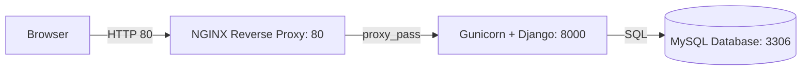

# 🐳 Dockerized Django Application with MySQL & NGINX

I have created a Dockerized environment for an existing Django app, using MySQL for persistence and NGINX as a reverse proxy. It demonstrates how I isolated services into containers, wired them together with Docker Compose, and managed startup order and health checks.

---

## 📌 Table of Contents

- [Project Overview](#project-overview)  
- [Architecture](#architecture)  
- [Technology Stack](#technology-stack)  
- [Setup & Installation](#setup--installation)  
- [Docker Breakdown](#docker-breakdown)  
- [Common Commands](#common-commands)  
- [Troubleshooting](#troubleshooting)  

---

## 🧾 Project Overview

I’ve taken an existing Django application; in this repo I demonstrate how I:

- Containerize Django (with Gunicorn)

- Connect it to a MySQL database container

- Front it with an NGINX reverse proxy

- Orchestrate everything via Docker Compose

---

## 🧱 Architecture



---

## ⚙️ Technology Stack

| Layer         | Tool               |
|---------------|--------------------|
| Web Server    | NGINX (alpine)     |
| App Server    | Django + Gunicorn  |
| Database      | MySQL (5.7 or 8)   |
| Container     | Docker             |
| Orchestration | Docker Compose     |

---

## 🚀 Setup & Installation

1. **Clone the repository**  
   ```bash
   git clone https://github.com/DevDetroja10/dockerized-django-infra
   ```
2. Build and start all services
   ```bash
   docker-compose up --build
   ```
3. Access the application
   Open your browser to http://localhost.

---

## 🐋 Docker Breakdown

- **Django container**
  - Built from `DJANGO-NOTES-APP/Dockerfile`
  - Runs a startup command that applies migrations and launches Gunicorn directly via docker-compose.

- **MySQL container**
  - Uses the official `mysql` image
  - Configured via environment variables:
    - `MYSQL_ROOT_PASSWORD=root`
    - `MYSQL_DATABASE=test_db`
  - Persists data using a bind mount: `./data/mysql/db:/var/lib/mysql`

- **NGINX container**
  - Based on `nginx:1.23.3-alpine`
  - Uses `default.conf` (copied to `/etc/nginx/conf.d/`) to route incoming HTTP traffic to the Django container
  - Acts as a reverse proxy, forwarding requests from port 80 to the Django app running on port 8000

- **Docker Compose**
  - Defines all three services
  - Sets up a private network for inter-container communication
  - Uses `depends_on` and optional healthchecks to manage startup order.

---

## 📦 Common Commands

| Action                     | Command                          |
|----------------------------|----------------------------------|
| Start all services         | `docker compose up`      |
| Stop and remove containers | `docker compose down`         |
| View logs                  | `docker compose logs`         |

---

## 🩺 Troubleshooting

- **“Could not connect to MySQL”**
  - Make sure your .env file contains the correct DB_HOST value — it should match the container name specified in docker-compose.yml.
  - Verify the MySQL container is healthy: `docker compose ps`.

- **Port 80 already in use**
  - Either stop the conflicting service or update the `ports:` mapping under the `nginx` service in `docker-compose.yml`.

- **Data lost after restart**
  - Ensure that your bind mount is correctly configured to persist MySQL data.

